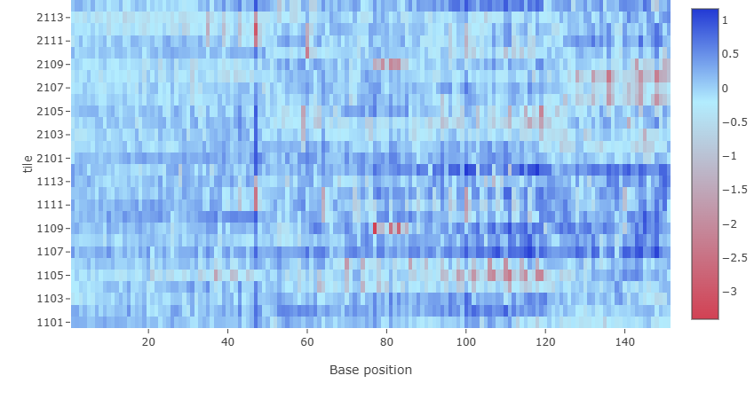
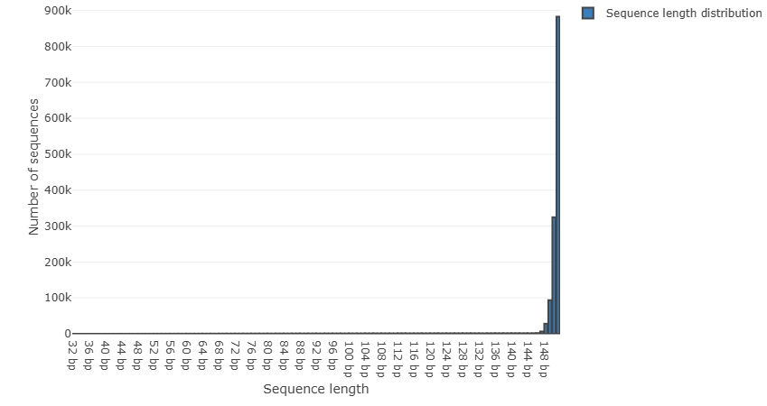

# Introduction

Data from patients with a variant of cardiomyopathy will be studied in order get familiar with the process of analyzing sequenced DNA. The goal of this project is to spot genomic variations which may correlate to the disease.

## Cardiomyopathy

*Cardiomyopathy is a disease which affects the heart muscle.*

## Tools

*Galaxy, R Studio...*

# Data

*Explain about the data here*

## Quality Control

To evaluate the quality of the sequenced data the tool `Falco` was used. In this case we will input a `.fastQ.gz` file and receive several plots as output. Each plot points out a specific aspect of the data regarding quality and provides a score in the form of [pass]{style="color:#009900"}, [warn]{style="color:#999900"} or [fail]{style="color:#990000"}.

```{=html}
<pre style="background-color:#dee2e6; color:#2c3143; border:none">
<b>Falco</b> An alternative, more performant implementation of FastQC for high throughput sequence quality control
(Galaxy Version 1.2.4+galaxy0)
</pre>
```

### [Per base sequence quality](https://www.bioinformatics.babraham.ac.uk/projects/fastqc/Help/3%20Analysis%20Modules/2%20Per%20Base%20Sequence%20Quality.html)

This graph shows the quality values average in each base pair position read. The middle line is the median value, the boxes represent the inner 25% to 75% and the whiskers are the 10% and 90% points.


This test resulted in a pass. This is because no value is below 10 and no median is below 25.

### [Per tile sequence quality](https://www.bioinformatics.babraham.ac.uk/projects/fastqc/Help/3%20Analysis%20Modules/12%20Per%20Tile%20Sequence%20Quality.html)

This test gives quality scores on each base pair position per tile in the sequencer flow cell. A heat map like pattern represents above average values with cold colors and below average values with hot ones.



The test resulted in a pass and there are no consistent low values for any given tile.

### [Per sequence quality scores](https://www.bioinformatics.babraham.ac.uk/projects/fastqc/Help/3%20Analysis%20Modules/3%20Per%20Sequence%20Quality%20Scores.html)

This plot shows the amount of sequences per Phred score, the highest density value being the average score.


This test resulted in a pass as the most frequently observed values are above 27.

### [Per base sequence content](https://www.bioinformatics.babraham.ac.uk/projects/fastqc/Help/3%20Analysis%20Modules/4%20Per%20Base%20Sequence%20Content.html)

Here the percentage amount of each nucleotide A, C, T and G is plotted per base pair position. It is expected to have a equally consistent amount of A and T as well as C and G.


This test resulted in a fail. However, all sequencers produce inaccurate readings for this test at the start of the sequence.

### [Per sequence GC content](https://www.bioinformatics.babraham.ac.uk/projects/fastqc/Help/3%20Analysis%20Modules/5%20Per%20Sequence%20GC%20Content.html)

This plot shows the Guanine and Cytosine percent amount against a theoretical normal distribution.


The result is a pass given that the sum of deviation from the normal distribution does not exceed 15% of all reads.

### [Per base N content](https://www.bioinformatics.babraham.ac.uk/projects/fastqc/Help/3%20Analysis%20Modules/6%20Per%20Base%20N%20Content.html)

If the sequencer is unable to confidently assign a base it will substitute it with an N. This test shows the percent amount of N per base pair position.


The test resulted in a pass, because no position has more than 5%.

### [Sequence Length Distribution](https://www.bioinformatics.babraham.ac.uk/projects/fastqc/Help/3%20Analysis%20Modules/7%20Sequence%20Length%20Distribution.html)



### [Sequence Duplication Levels](https://www.bioinformatics.babraham.ac.uk/projects/fastqc/Help/3%20Analysis%20Modules/8%20Duplicate%20Sequences.html)


## Trimming
