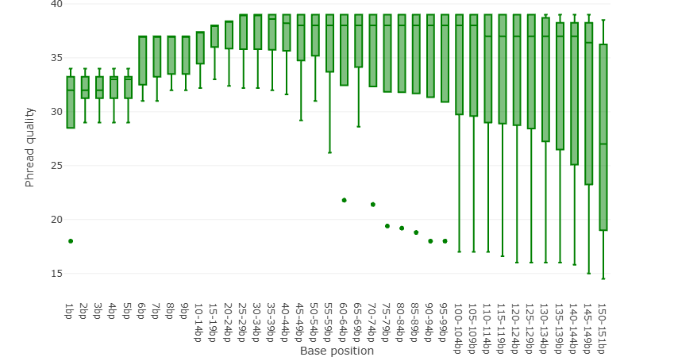
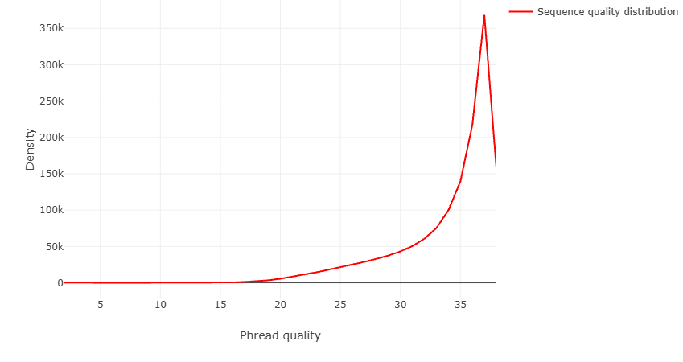
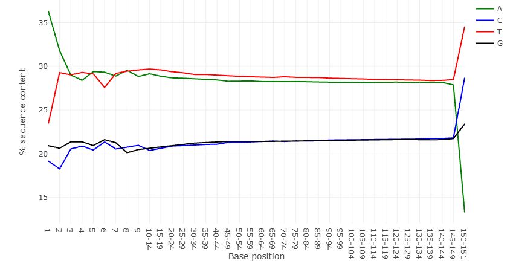
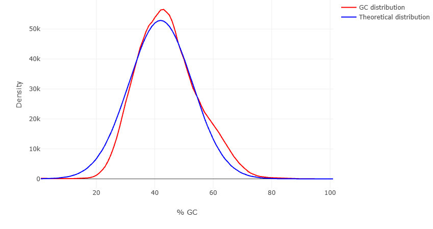
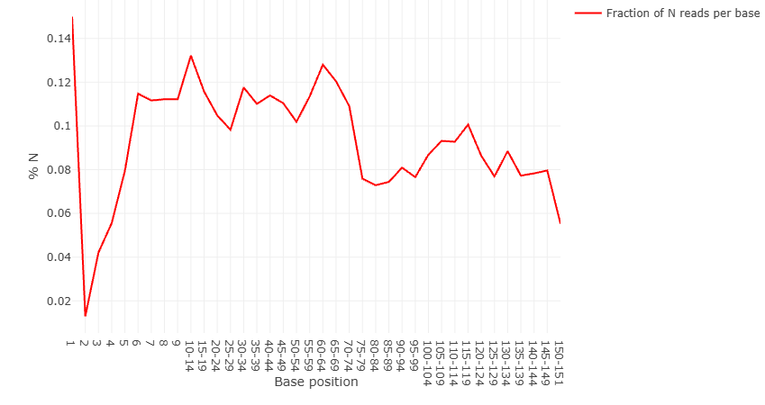
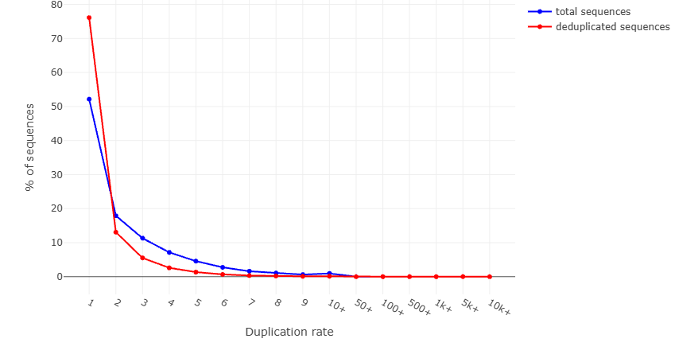

# Introduction

Data from patients with a variant of cardiomyopathy will be studied in order get familiar with the process of analyzing sequenced DNA. The goal of this project is to spot genomic variations which may correlate to the disease.

## Cardiomyopathy

*Cardiomyopathy is a disease which affects the heart muscle.*

## Tools

*Galaxy, R Studio...*

# Data

*Explain about the data here*

## Quality Control

To evaluate the quality of the sequenced data the tool `Falco` was used. In this case we will input a `.fastQ.gz` file and receive several plots as output. Each plot points out a specific aspect of the data regarding quality and provides a score in the form of [pass]{style="color:#009900"}, [warn]{style="color:#999900"} or [fail]{style="color:#990000"}.

```{=html}
<pre style="background-color:#dee2e6; color:#2c3143; border:none">
<b>Falco</b> An alternative, more performant implementation of FastQC for high throughput sequence quality control
(Galaxy Version 1.2.4+galaxy0)
</pre>
```

### Per base sequence quality (pass)



### Per tile sequence quality (pass)


### Per sequence quality scores (pass)



### Per base sequence content (fail)



### Per sequence GC content (pass)



### Per base N content (pass)



### Sequence Length Distribution (warn)


### Sequence Duplication Levels (warn)



## Trimming
