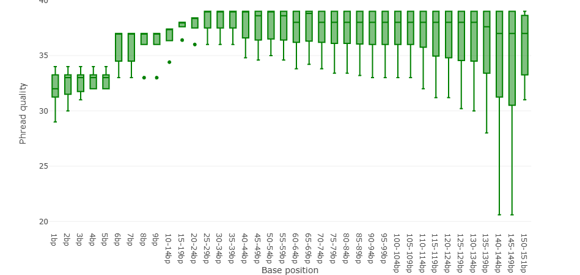

# Introduction

Data from patients with a variant of cardiomyopathy will be studied in order get familiar with the process of analyzing sequenced DNA. The goal of this project is to spot genomic variations which may correlate to the disease.

## Cardiomyopathy

*Cardiomyopathy is a disease which affects the heart muscle.*

## Tools

| Tool    | Purpose                  |
|---------|--------------------------|
| RStudio | Writing documentation    |
| Galaxy  | Data processing pipeline |

# Data

The raw data is a `fastQ.gz` file, which includes DNA strands resulted from sequencing as well as some information about the sequencing process. This is the first entry of the file:

```         
@M01234:01:000000000-A1B2C:1:1101:16810:1655 2:N:0:2
AATGACATTGATCTCCACAGCCATCAAGAGCCCATTCAAGATGACCATCATGCCTGTGATGCAGAAACGCAGGTTTGATATGTCCAAGCCAGACTGACAGTACTTAACCAATTTTATTGTTTTTGTAATAAAGGCCCTTACCCAATACAGG
+
11A11DDFDDB@GGGGCF11FA1GGF1GBCCBFHHHHGHFCGHFFHFHB1F1FFHBF1BG2DFBGF1FC/EE/A1D/1A2DBGGHFFFE/000FG11BF1GFGFHHFHHEHHHGHHGBDFHFHG/BE2F2>FH1>E/FE11BG</B1<110
```

Each line describes the following:

-   An identifier for the sequencing machine, the chip it used and the specific position within it.
-   The DNA nucleotides in order given by the sequence.
-   A plus sign.
-   A corresponding quality identifier for each nucleotide, also given by the sequencer.

## Quality Control

To evaluate the quality of the sequenced data the tool `Falco` was used. In this case we will input a `.fastQ.gz` file and receive several plots as output. Each plot points out a specific aspect of the data regarding quality and provides a score in the form of [pass]{style="color:#009900"}, [warn]{style="color:#999900"} or [fail]{style="color:#990000"}.

```{=html}
<pre style="background-color:#dee2e6; color:#2c3143; border:none">
<b>Falco</b> An alternative, more performant implementation of FastQC for high throughput sequence quality control
(Galaxy Version 1.2.4+galaxy0)
</pre>
```

Tool parameters set to *default*.

### Basic Statistics

| Measure                           | Value                                |
|-----------------------------------|--------------------------------------|
| Filename                          | Sample1_0394321_L001_R2_001_fastq_gz |
| File type                         | Conventional base calls              |
| Encoding                          | Sanger / Illumina 1.9                |
| Total Sequences                   | 1424257                              |
| Sequences Flagged As Poor Quality | 0                                    |
| Sequence length                   | 32 - 151                             |
| %GC:                              | 43                                   |

### [Per base sequence quality](https://www.bioinformatics.babraham.ac.uk/projects/fastqc/Help/3%20Analysis%20Modules/2%20Per%20Base%20Sequence%20Quality.html)

This graph shows the quality values average in each base pair position read. The middle line is the median value, the boxes represent the inner 25% to 75% and the whiskers are the 10% and 90% points.


This test resulted in a pass. This is because no value is below 10 and no median is below 25. Quality decreases at the end of the sequences due to [phasing](https://www.ecseq.com/support/ngs/why-does-the-sequence-quality-decrease-over-the-read-in-illumina). This is a small chance that a nucleotide is misplaced, which with longer sequences adds up.

### [Per tile sequence quality](https://www.bioinformatics.babraham.ac.uk/projects/fastqc/Help/3%20Analysis%20Modules/12%20Per%20Tile%20Sequence%20Quality.html)

This test gives quality scores on each base pair position per tile in the sequencer flow cell. A heat map like pattern represents above average values with cold colors and below average values with hot ones.


The test resulted in a pass and there are no consistent low values for any given tile.

### [Per sequence quality scores](https://www.bioinformatics.babraham.ac.uk/projects/fastqc/Help/3%20Analysis%20Modules/3%20Per%20Sequence%20Quality%20Scores.html)

This plot shows the amount of sequences per Phred score, the highest density value being the average score.


This test resulted in a pass as the most frequently observed values are above 27.

### [Per base sequence content](https://www.bioinformatics.babraham.ac.uk/projects/fastqc/Help/3%20Analysis%20Modules/4%20Per%20Base%20Sequence%20Content.html)

Here the percentage amount of each nucleotide A, C, T and G is plotted per base pair position. It is expected to have a equally consistent amount of A and T as well as C and G.


This test resulted in a fail. However, all sequencers produce inaccurate readings for this test at the start of the sequence.

### [Per sequence GC content](https://www.bioinformatics.babraham.ac.uk/projects/fastqc/Help/3%20Analysis%20Modules/5%20Per%20Sequence%20GC%20Content.html)

This plot shows the Guanine and Cytosine percent amount against a theoretical normal distribution.


The result is a pass given that the sum of deviation from the normal distribution does not exceed 15% of all reads.

### [Per base N content](https://www.bioinformatics.babraham.ac.uk/projects/fastqc/Help/3%20Analysis%20Modules/6%20Per%20Base%20N%20Content.html)

If the sequencer is unable to confidently assign a base it will substitute it with an N. This test shows the percent amount of N per base pair position.


The test resulted in a pass, because no position has more than 5%.

### [Sequence Length Distribution](https://www.bioinformatics.babraham.ac.uk/projects/fastqc/Help/3%20Analysis%20Modules/7%20Sequence%20Length%20Distribution.html)


### [Sequence Duplication Levels](https://www.bioinformatics.babraham.ac.uk/projects/fastqc/Help/3%20Analysis%20Modules/8%20Duplicate%20Sequences.html)


## Trimming

The next step is to trim the data and keep only values with a certain minimum quality score. For this the tool `Trimmomatic` was used.

```{=html}
<pre style="background-color:#dee2e6; color:#2c3143; border:none">
<b>Trimmomatic</b> flexible read trimming tool for Illumina NGS data
(Galaxy Version 0.39+galaxy2)
</pre>
```

`Trimmomatic` outputs 2 sets of files, 2 paired and 2 unpaired for the corresponding R1 and R2 strands. Some discarded sequences from one strand may have not been discarded on the other, these are shown on the unpaired files. The paired files show only matching non-discarded sequences in both strands. We will only continue with the paired files.

In order to compare the trimmed values the `Falco` tool was used, but this time on the trimmed data. Multiple iteration of the trim with different tool inputs were done.

### First trim

| Input Parameter | Value |
|------------------------------------|------------------------------------|
| Single-end or paired-end reads? | pair_of_files |
| Input FASTQ file (R1/first of pair) |  |
| Input FASTQ file (R2/second of pair) |  |
| Perform initial ILLUMINACLIP step? | true |
| Select standard adapter sequences or provide custom? | standard |
| Adapter sequences to use | TruSeq3 (paired-ended, for MiSeq and HiSeq) |
| Maximum mismatch count which will still allow a full match to be performed | 2 |
| How accurate the match between the two 'adapter ligated' reads must be for PE palindrome read alignment | 30 |
| How accurate the match between any adapter etc. sequence must be against a read | 10 |
| Minimum length of adapter that needs to be detected (PE specific/palindrome mode) | 8 |
| Always keep both reads (PE specific/palindrome mode)? | true |
| Select Trimmomatic operation to perform | SLIDINGWINDOW |
| Number of bases to average across | 4 |
| Average quality required | 20 |
| Select Trimmomatic operation to perform | MINLEN |
| Minimum length of reads to be kept | 70 |
| Quality score encoding | Nothing selected. |
| Output trimlog file? | false |
| Output trimmomatic log messages? | false |

#### Basic Statistics

| Measure | Value |
|:--:|:--:|
| Filename | Trimmomatic on Sample1_0394321_L001_R2_001_fastq_gz \_R2 paired\_ |
| File type | Conventional base calls |
| Encoding | Sanger / Illumina 1.9 |
| Total Sequences | 1172109 |
| Sequences Flagged As Poor Quality | 0 |
| Sequence length | 70 - 151 |
| %GC: | 42 |

#### Per base sequence quality


