# Introduction

Data from patients with a variant of cardiomyopathy will be studied in order get familiar with the process of analyzing sequenced DNA. The goal of this project is to spot genomic variations which may correlate to the disease.

## Cardiomyopathy

*Cardiomyopathy is a disease which affects the heart muscle.*

## Tools

|  Tool   |         Purpose          |
|:-------:|:------------------------:|
| RStudio |  Writing documentation   |
| Galaxy  | Data processing pipeline |

# Data

The raw data is a `fastQ.gz` file, which includes DNA strands resulted from sequencing as well as some information about the sequencing process. This is the first entry of the file:

```         
@M01234:01:000000000-A1B2C:1:1101:16810:1655 2:N:0:2
AATGACATTGATCTCCACAGCCATCAAGAGCCCATTCAAGATGACCATCATGCCTGTGATGCAGAAACGCAGGTTTGATATGTCCAAGCCAGACTGACAGTACTTAACCAATTTTATTGTTTTTGTAATAAAGGCCCTTACCCAATACAGG
+
11A11DDFDDB@GGGGCF11FA1GGF1GBCCBFHHHHGHFCGHFFHFHB1F1FFHBF1BG2DFBGF1FC/EE/A1D/1A2DBGGHFFFE/000FG11BF1GFGFHHFHHEHHHGHHGBDFHFHG/BE2F2>FH1>E/FE11BG</B1<110
```

Each line describes the following:

-   An identifier for the sequencing machine, the chip it used and the specific position within it.
-   The DNA nucleotides in order given by the sequence.
-   A plus sign.
-   A corresponding quality identifier for each nucleotide, also given by the sequencer.

## Quality Control

To evaluate the quality of the sequenced data the tool `Falco` was used. In this case we will input a `.fastQ.gz` file and receive several plots as output. Each plot points out a specific aspect of the data regarding quality and provides a score in the form of [pass]{style="color:#009900"}, [warn]{style="color:#999900"} or [fail]{style="color:#990000"}.

```{=html}
<pre style="background-color:#dee2e6; color:#2c3143; border:none">
<b>Falco</b> An alternative, more performant implementation of FastQC for high throughput sequence quality control
(Galaxy Version 1.2.4+galaxy0)
</pre>
```

Tool parameters set to *default*.

### Basic Statistics

| Measure                           | Value                   |
|-----------------------------------|-------------------------|
| Filename                          |                         |
| File type                         | Conventional base calls |
| Encoding                          | Sanger / Illumina 1.9   |
| Total Sequences                   | 1424257                 |
| Sequences Flagged As Poor Quality | 0                       |
| Sequence length                   | 32 - 151                |
| %GC:                              | 43                      |

### [Per base sequence quality](https://www.bioinformatics.babraham.ac.uk/projects/fastqc/Help/3%20Analysis%20Modules/2%20Per%20Base%20Sequence%20Quality.html)

This graph shows the quality values average in each base pair position read. The middle line is the median value, the boxes represent the inner 25% to 75% and the whiskers are the 10% and 90% points.

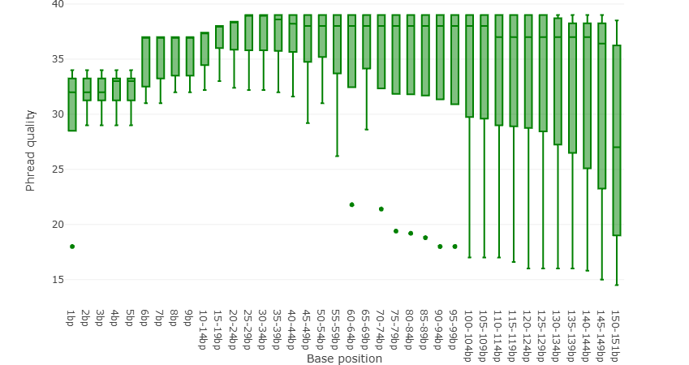

This test resulted in a pass. This is because no value is below 10 and no median is below 25. Quality decreases at the end of the sequences due to [phasing](https://www.ecseq.com/support/ngs/why-does-the-sequence-quality-decrease-over-the-read-in-illumina). This is a small chance that a nucleotide is misplaced, which with longer sequences adds up.

### [Per tile sequence quality](https://www.bioinformatics.babraham.ac.uk/projects/fastqc/Help/3%20Analysis%20Modules/12%20Per%20Tile%20Sequence%20Quality.html)

This test gives quality scores on each base pair position per tile in the sequencer flow cell. A heat map like pattern represents above average values with cold colors and below average values with hot ones.

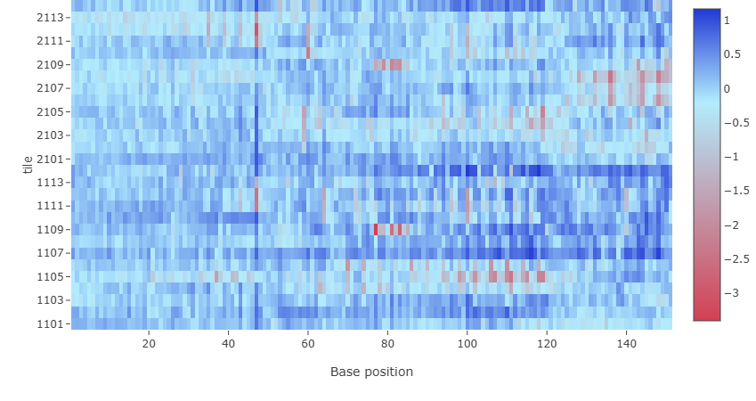

The test resulted in a pass and there are no consistent low values for any given tile.

### [Per sequence quality scores](https://www.bioinformatics.babraham.ac.uk/projects/fastqc/Help/3%20Analysis%20Modules/3%20Per%20Sequence%20Quality%20Scores.html)

This plot shows the amount of sequences per Phred score, the highest density value being the average score.

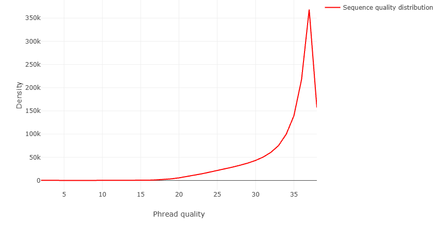

This test resulted in a pass as the most frequently observed values are above 27.

### [Per base sequence content](https://www.bioinformatics.babraham.ac.uk/projects/fastqc/Help/3%20Analysis%20Modules/4%20Per%20Base%20Sequence%20Content.html)

Here the percentage amount of each nucleotide A, C, T and G is plotted per base pair position. It is expected to have a equally consistent amount of A and T as well as C and G.

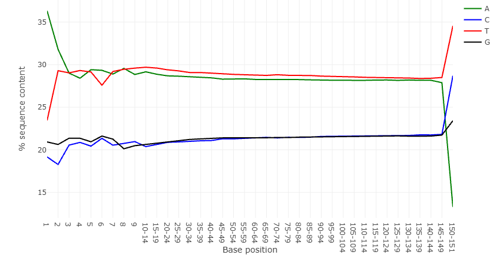

This test resulted in a fail. However, all sequencers produce inaccurate readings for this test at the start of the sequence.

### [Per sequence GC content](https://www.bioinformatics.babraham.ac.uk/projects/fastqc/Help/3%20Analysis%20Modules/5%20Per%20Sequence%20GC%20Content.html)

This plot shows the Guanine and Cytosine percent amount against a theoretical normal distribution.

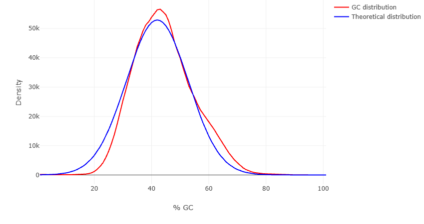

The result is a pass given that the sum of deviation from the normal distribution does not exceed 15% of all reads.

### [Per base N content](https://www.bioinformatics.babraham.ac.uk/projects/fastqc/Help/3%20Analysis%20Modules/6%20Per%20Base%20N%20Content.html)

If the sequencer is unable to confidently assign a base it will substitute it with an N. This test shows the percent amount of N per base pair position.

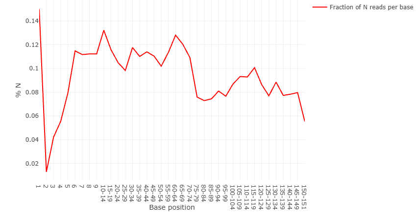

The test resulted in a pass, because no position has more than 5%.

### [Sequence Length Distribution](https://www.bioinformatics.babraham.ac.uk/projects/fastqc/Help/3%20Analysis%20Modules/7%20Sequence%20Length%20Distribution.html)

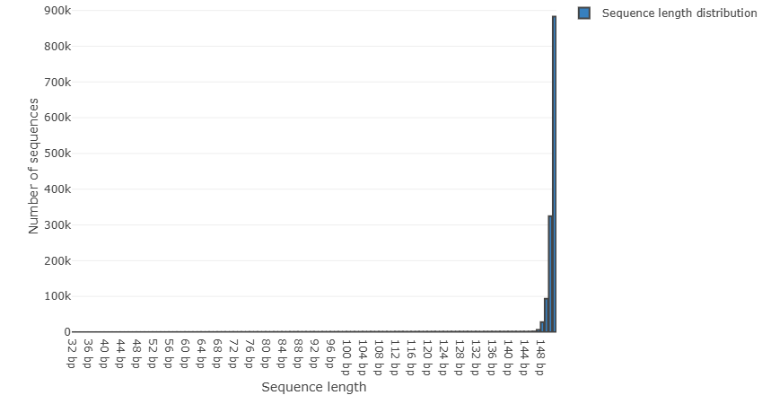

### [Sequence Duplication Levels](https://www.bioinformatics.babraham.ac.uk/projects/fastqc/Help/3%20Analysis%20Modules/8%20Duplicate%20Sequences.html)

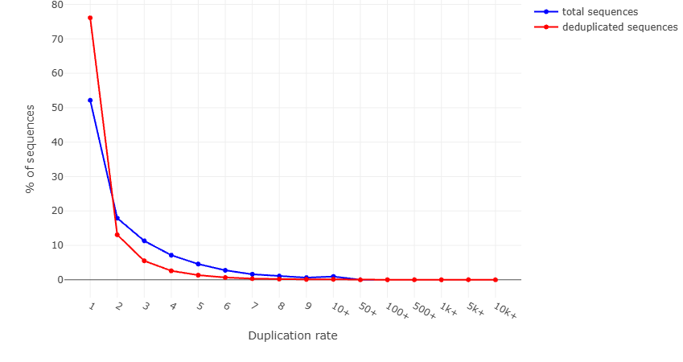

## Trimming

The next step is to trim the data and keep only values with a certain minimum quality score. For this the tool `Trimmomatic` was used.

```{=html}
<pre style="background-color:#dee2e6; color:#2c3143; border:none">
<b>Trimmomatic</b> flexible read trimming tool for Illumina NGS data
(Galaxy Version 0.39+galaxy2)
</pre>
```

`Trimmomatic` outputs 2 sets of files, 2 paired and 2 unpaired for the corresponding R1 and R2 strands. Some discarded sequences from one strand may have not been discarded on the other, these are shown on the unpaired files. The paired files show only matching non-discarded sequences in both strands. We will only continue with the paired files.

In order to compare the trimmed values the `Falco` tool was used, but this time on the trimmed data. Multiple iteration of the trim with different tool inputs were done.

### First trim

| Input Parameter | Value |
|------------------------------------|------------------------------------|
| Single-end or paired-end reads? | pair_of_files |
| Input FASTQ file (R1/first of pair) | *R1 file* |
| Input FASTQ file (R2/second of pair) | *R2 file* |
| Perform initial ILLUMINACLIP step? | true |
| Select standard adapter sequences or provide custom? | standard |
| Adapter sequences to use | TruSeq3 (paired-ended, for MiSeq and HiSeq) |
| Maximum mismatch count which will still allow a full match to be performed | 2 |
| How accurate the match between the two 'adapter ligated' reads must be for PE palindrome read alignment | 30 |
| How accurate the match between any adapter etc. sequence must be against a read | 10 |
| Minimum length of adapter that needs to be detected (PE specific/palindrome mode) | 8 |
| Always keep both reads (PE specific/palindrome mode)? | true |
| Select Trimmomatic operation to perform | SLIDINGWINDOW |
| Number of bases to average across | 4 |
| Average quality required | 20 |
| Select Trimmomatic operation to perform | MINLEN |
| Minimum length of reads to be kept | 70 |
| Quality score encoding | Nothing selected. |
| Output trimlog file? | false |
| Output trimmomatic log messages? | false |

#### Basic Statistics

|              Measure              |          Value          |
|:---------------------------------:|:-----------------------:|
|             Filename              |                         |
|             File type             | Conventional base calls |
|             Encoding              |  Sanger / Illumina 1.9  |
|          Total Sequences          |         1172109         |
| Sequences Flagged As Poor Quality |            0            |
|          Sequence length          |        70 - 151         |
|               %GC:                |           42            |

#### Per base sequence quality

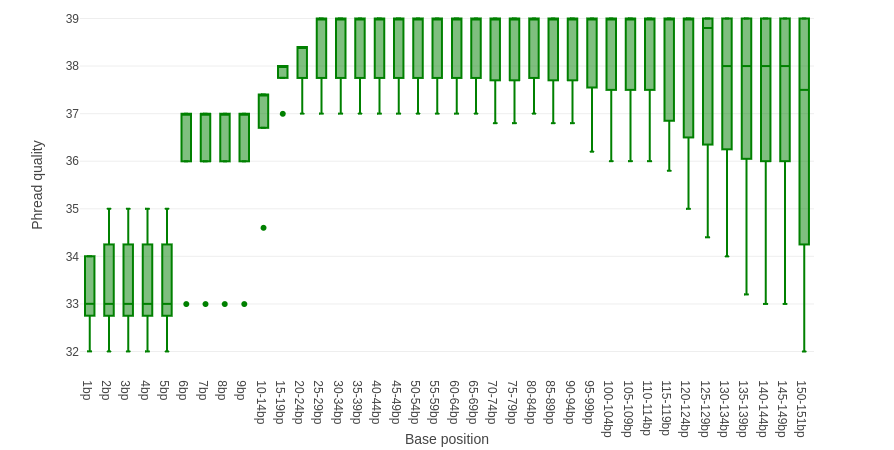

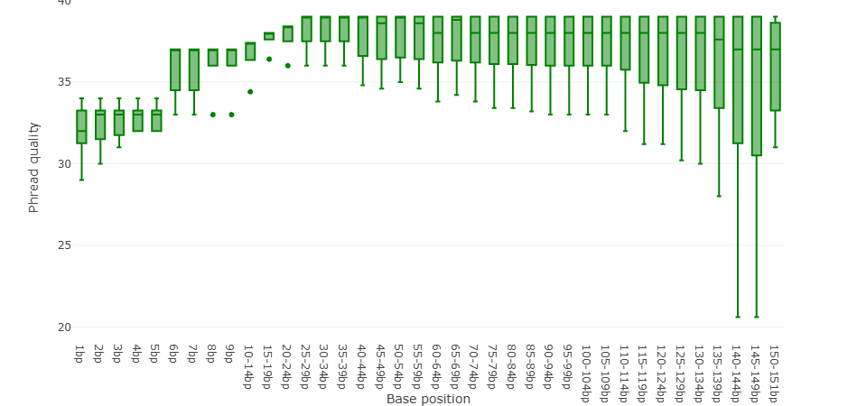

### Second trim

| Input Parameter | Value |
|------------------------------------|------------------------------------|
| Single-end or paired-end reads? | pair_of_files |
| Input FASTQ file (R1/first of pair) | *R1 file* |
| Input FASTQ file (R2/second of pair) | *R2 file* |
| Perform initial ILLUMINACLIP step? | true |
| Select standard adapter sequences or provide custom? | standard |
| Adapter sequences to use | TruSeq3 (paired-ended, for MiSeq and HiSeq) |
| Maximum mismatch count which will still allow a full match to be performed | 2 |
| How accurate the match between the two 'adapter ligated' reads must be for PE palindrome read alignment | 30 |
| How accurate the match between any adapter etc. sequence must be against a read | 10 |
| Minimum length of adapter that needs to be detected (PE specific/palindrome mode) | 8 |
| Always keep both reads (PE specific/palindrome mode)? | true |
| Select Trimmomatic operation to perform | SLIDINGWINDOW |
| Number of bases to average across | 4 |
| Average quality required | 30 |
| Select Trimmomatic operation to perform | MINLEN |
| Minimum length of reads to be kept | 70 |
| Quality score encoding | Nothing selected. |
| Output trimlog file? | false |
| Output trimmomatic log messages? | false |

#### Basic statistics

|              Measure              |          Value          |
|:---------------------------------:|:-----------------------:|
|             Filename              |                         |
|             File type             | Conventional base calls |
|             Encoding              |  Sanger / Illumina 1.9  |
|          Total Sequences          |         754143          |
| Sequences Flagged As Poor Quality |            0            |
|          Sequence length          |        70 - 151         |
|               %GC:                |           41            |

#### Per base sequence quality

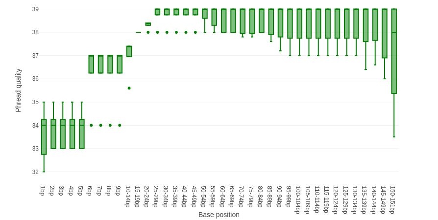

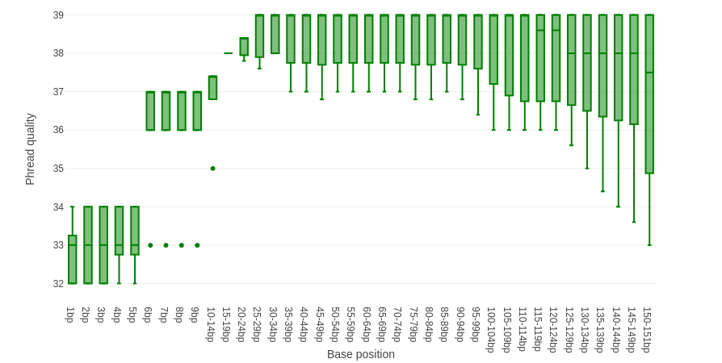

### Third trim

| Input Parameter | Value |
|------------------------------------|------------------------------------|
| Single-end or paired-end reads? | pair_of_files |
| Input FASTQ file (R1/first of pair) | *R1 file* |
| Input FASTQ file (R2/second of pair) | *R2 file* |
| Perform initial ILLUMINACLIP step? | true |
| Select standard adapter sequences or provide custom? | standard |
| Adapter sequences to use | TruSeq3 (paired-ended, for MiSeq and HiSeq) |
| Maximum mismatch count which will still allow a full match to be performed | 2 |
| How accurate the match between the two 'adapter ligated' reads must be for PE palindrome read alignment | 30 |
| How accurate the match between any adapter etc. sequence must be against a read | 10 |
| Minimum length of adapter that needs to be detected (PE specific/palindrome mode) | 8 |
| Always keep both reads (PE specific/palindrome mode)? | true |
| Select Trimmomatic operation to perform | SLIDINGWINDOW |
| Number of bases to average across | 4 |
| Average quality required | 30 |
| Select Trimmomatic operation to perform | MINLEN |
| Minimum length of reads to be kept | 100 |
| Quality score encoding | Nothing selected. |
| Output trimlog file? | false |
| Output trimmomatic log messages? | false |

#### Basic Statistics

|              Measure              |          Value          |
|:---------------------------------:|:-----------------------:|
|             Filename              |                         |
|             File type             | Conventional base calls |
|             Encoding              |  Sanger / Illumina 1.9  |
|          Total Sequences          |         639254          |
| Sequences Flagged As Poor Quality |            0            |
|          Sequence length          |        100 - 151        |
|               %GC:                |           41            |

#### Per base sequence quality

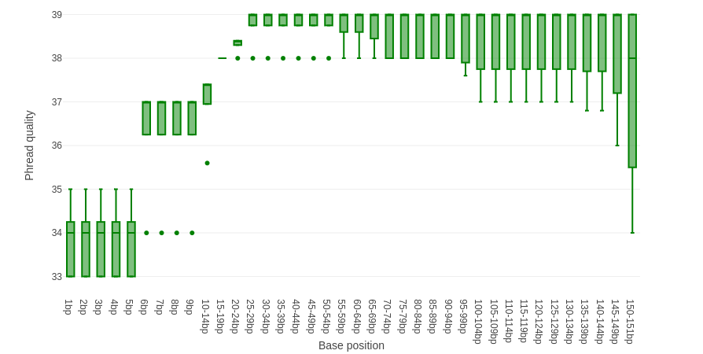


### Fourth trim

| Input Parameter | Value |
|------------------------------------|------------------------------------|
| Single-end or paired-end reads? | pair_of_files |
| Input FASTQ file (R1/first of pair) | *R1 file* |
| Input FASTQ file (R2/second of pair) | *R2 file* |
| Perform initial ILLUMINACLIP step? | true |
| Select standard adapter sequences or provide custom? | standard |
| Adapter sequences to use | TruSeq3 (paired-ended, for MiSeq and HiSeq) |
| Maximum mismatch count which will still allow a full match to be performed | 2 |
| How accurate the match between the two 'adapter ligated' reads must be for PE palindrome read alignment | 30 |
| How accurate the match between any adapter etc. sequence must be against a read | 10 |
| Minimum length of adapter that needs to be detected (PE specific/palindrome mode) | 8 |
| Always keep both reads (PE specific/palindrome mode)? | true |
| Select Trimmomatic operation to perform | SLIDINGWINDOW |
| Number of bases to average across | 4 |
| Average quality required | 30 |
| Select Trimmomatic operation to perform | MINLEN |
| Minimum length of reads to be kept | 50 |
| Quality score encoding | Nothing selected. |
| Output trimlog file? | false |
| Output trimmomatic log messages? | false |

#### Basic Statistics

|              Measure              |          Value          |
|:---------------------------------:|:-----------------------:|
|             Filename              |                         |
|             File type             | Conventional base calls |
|             Encoding              |  Sanger / Illumina 1.9  |
|          Total Sequences          |         822515          |
| Sequences Flagged As Poor Quality |            0            |
|          Sequence length          |        50 - 151         |
|               %GC:                |           42            |

#### Per base sequence quality

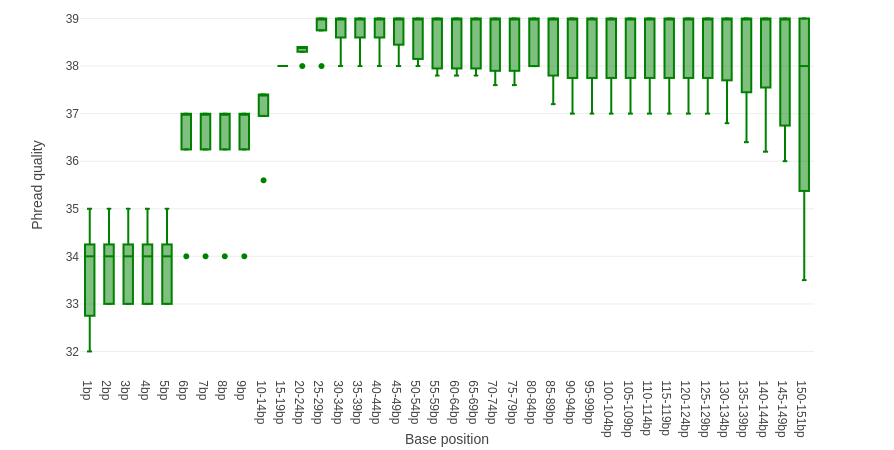

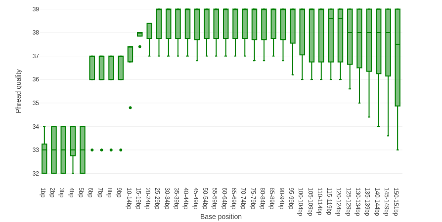

### Fifth trim

| Input Parameter | Value |
|------------------------------------|------------------------------------|
| Single-end or paired-end reads? | pair_of_files |
| Input FASTQ file (R1/first of pair) | *R1 file* |
| Input FASTQ file (R2/second of pair) | *R2 file* |
| Perform initial ILLUMINACLIP step? | true |
| Select standard adapter sequences or provide custom? | standard |
| Adapter sequences to use | TruSeq3 (paired-ended, for MiSeq and HiSeq) |
| Maximum mismatch count which will still allow a full match to be performed | 2 |
| How accurate the match between the two 'adapter ligated' reads must be for PE palindrome read alignment | 30 |
| How accurate the match between any adapter etc. sequence must be against a read | 10 |
| Minimum length of adapter that needs to be detected (PE specific/palindrome mode) | 8 |
| Always keep both reads (PE specific/palindrome mode)? | true |
| Select Trimmomatic operation to perform | SLIDINGWINDOW |
| Number of bases to average across | 4 |
| Average quality required | 20 |
| Select Trimmomatic operation to perform | MINLEN |
| Minimum length of reads to be kept | 50 |
| Quality score encoding | Nothing selected. |
| Output trimlog file? | false |
| Output trimmomatic log messages? | false |

#### Basic Statistics

|              Measure              |          Value          |
|:---------------------------------:|:-----------------------:|
|             Filename              |                         |
|             File type             | Conventional base calls |
|             Encoding              |  Sanger / Illumina 1.9  |
|          Total Sequences          |         1224621         |
| Sequences Flagged As Poor Quality |            0            |
|          Sequence length          |        50 - 151         |
|               %GC:                |           42            |

#### Per base sequence quality

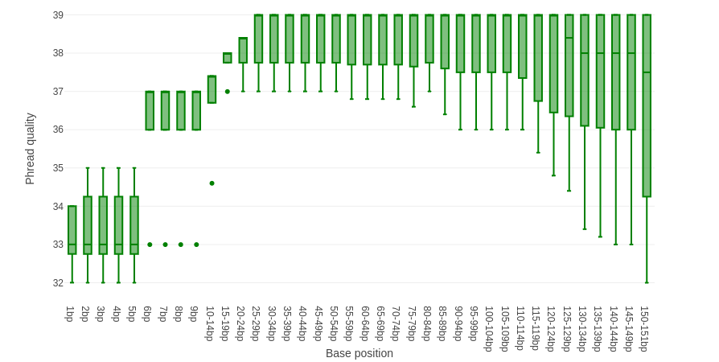

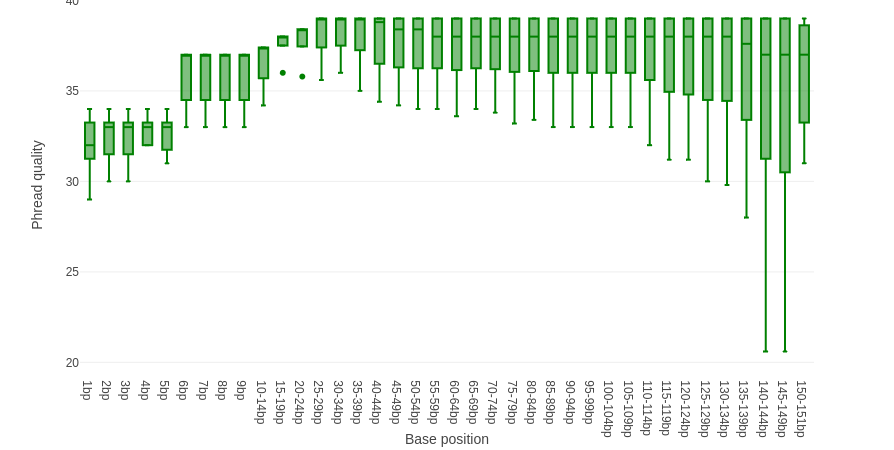

### Results

```{r echo = FALSE}
totalSequences <- 1424257

PercentSequencesRemoved <- function(x){
  percentSequencesLeft <- ((x * 100) / totalSequences)
  round(100 - percentSequencesLeft, digits = 2)
}
```

| Trim number | Avg. quality required | Min. read length to keep | \% sequences removed |
|:----------------:|:----------------:|:----------------:|:----------------:|
| 1st | 20 | 70 | `r PercentSequencesRemoved(1172109)` |
| 2nd | 30 | 70 | `r PercentSequencesRemoved(754143)` |
| 3rd | 30 | 100 | `r PercentSequencesRemoved(639254)` |
| 4th | 30 | 50 | `r PercentSequencesRemoved(822515)` |
| 5th | 20 | 50 | `r PercentSequencesRemoved(1224621)` |

## Mapping

*explain*

### Expected coverage

A sequence's coverage or read depth is the average amount of reads of each region in a given genome. To calculate the coverage we can use the formula `C = LN/G`, where `C = coverage`, `L = read length`, `N = number of reads` and `G = captured region`. This results in an expected or estimated coverage, as many reads could not be distributed evenly.

```{r}
Coverage <- function(readLength, readAmount, capturedRegion){
  (readLength * readAmount) / capturedRegion
}
```

```{r}
# Our expected coverage on CardioPanel
#
# 50 min. & 138 max. sequence length
# 1206159 total sequences, times 2 strands
# 320000 bases for the CarioPanel 
Coverage(88, 1206159 * 2, 320000)

# "Max Illumina sequencer coverage on CardioPanel
#
# 300 max Illumina sequence length
# 25000000 max Illumina reads
# 320000 bases for the CardioPanel
Coverage(300, 25000000, 320000)
```

The resulting expected read depth is \~ 663. Which means spotted DNA variants should be of high confidence. However, the actual coverage of each region should be also checked after the following mapping steps.

### Mapping with BWA

| Input Parameter | Value |
|------------------------------------|------------------------------------|
| Will you select a reference genome from your history or use a built-in index? | cached |
| Using reference genome | hg38 |
| Single or Paired-end reads | paired |
| Select first set of reads |  |
| Select second set of reads |  |
| Enter mean, standard deviation, max, and min for insert lengths. | Not available. |
| Set read groups information? | do_not_set |
| Select analysis mode | illumina |
| BAM sorting mode | Sort by chromosomal coordinates |

```{=html}
<pre style="background-color:#dee2e6; color:#2c3143; border:none">
<b>Map with BWA-MEM</b> - map medium and long reads (> 100 bp) against reference genome
(Galaxy Version 0.7.19)
</pre>
```

### Marking duplicate mapped reads

Tool...

```{=html}
<pre style="background-color:#dee2e6; color:#2c3143; border:none">
<b>Map with BWA-MEM</b> - map medium and long reads (> 100 bp) against reference genome
(Galaxy Version 0.7.19)
</pre>
```

### Visualizing the mapping data

IGV tool *explain*

Data/reference genome used *explain*

### Variant calling

The following variant is on the TTN gene. The nucleotide **A** from the reference gene is replaced with a **C**, which only changes one aminoacid (threonine is replaced with proline).

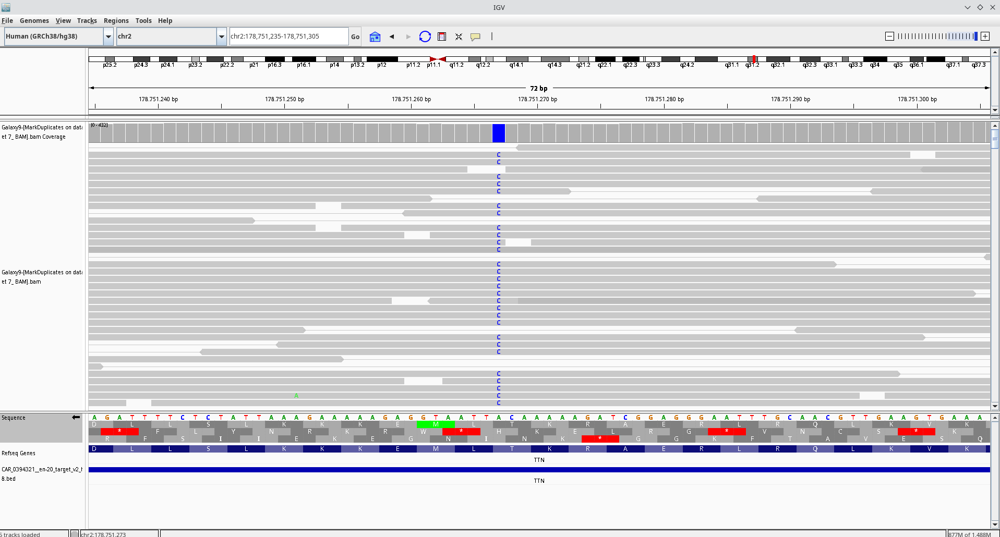

## Mapping Quality Control

### BED-data

```{r}

refGen <- read.table("./Reference-hg38.bed")
names(refGen) <- c("Chromosome", "Exon Start", "Exon End", "Gene")

chrCount <- tapply(refGen$Gene, refGen$Chromosome, length)

barplot(chrCount, las = 2,
        xlab = "Chromosome", ylab = "Gene frequency", 
        main = "Genes per chromosome")

```

### Bioconductor

```{r include=FALSE}
## Only needed when the package is missing
if (!require("BiocManager"))
    install.packages("BiocManager")

BiocManager::install("GenomicRanges")
```

```{r message=FALSE}
# This package contains the 'IRanges', 'GRanges' and 'GRangesList' classes we will use
library(GenomicRanges)
```

```{r}

( SOD2 <- refGen[refGen$Gene == "SOD2",] )

( iranges <- IRanges(start = SOD2$`Exon Start`, end = SOD2$`Exon End`, names = SOD2$Gene) )
cat("Length of SOD2:", sum( width(iranges) ), "bp")

( granges <- GRanges(seqnames = SOD2$Chromosome, ranges = iranges) )

```

```{r}

geneList <- list()
refGen$Gene[1]
for (geneName in unique(refGen$Gene)){
  gene <- refGen[refGen$Gene == geneName,]
  iranges <- IRanges(start = gene$`Exon Start`, end = gene$`Exon End`, names = gene$Gene)
  granges <- GRanges(seqnames = gene$Chromosome, ranges = iranges)
  geneList[[geneName]] <- granges
}

geneList <- GRangesList(geneList)
geneList
```

### Gene Lengths

```{r include=FALSE}
if (!require("plotrix"))
  install.packages("plotrix")
```

```{r message=FALSE}
library(plotrix)
```

```{r}

geneLengths <- sum(width(ranges(geneList)))
# Originally 123059
geneLengths["TTN"] <- 25000

barplot(geneLengths, axes = F, cex.names = 0.5, las = 2, ylim = c(0, 25000), main = "Gene Lengths")
axis(2, at = c(0, 5000, 10000, 15000, 20000, 25000), 
     labels = c("0", "5000", "10000", "15000", "20000", "123059"), las = 2)
axis.break(2, 20000, style = "gap", brw = 0.05)

```

### Loading the Mapped Reads

```{r include=FALSE}

# Installing required library
if (!require("Rsamtools"))
  BiocManager::install("Rsamtools")
```

```{r message=FALSE}
# Loading the RSamtools library
library(Rsamtools)

```

```{r}

bamFile <- BamFile("./MapReads.bam", index = "./MapReads.bai")
bamParam <- ScanBamParam(which = geneList[["NEXN"]], what = scanBamWhat())

bamPileup <- pileup(file = bamFile, scanBamParam = bamParam)
head(bamPileup)

```

### Pileup Processing

```{r}

genePileupList <- list()


for (geneName in names(geneList)) {
  bamParam <- ScanBamParam(which = geneList[[geneName]], what = scanBamWhat())
  bamPileup <- pileup(file = bamFile, scanBamParam = bamParam)
  genePileupList[[geneName]] <- bamPileup
}

head(genePileupList[["NEXN"]])

```

### Coverage calculation and reporting

```{r}

coverage = aggregate(x = list(count = genePileupList[["NEXN"]]$count), 
                     by = list(pos = genePileupList[["NEXN"]]$pos), FUN=sum)
head(coverage)

```

```{r}

geneCoverageList <- list()

for (geneName in names(geneList)) {
  coverage = aggregate(x = list(count = genePileupList[[geneName]]$count), 
                     by = list(pos = genePileupList[[geneName]]$pos), FUN=sum)
  geneCoverageList[[geneName]] <- coverage
}

```

```{r}

positionCount <- c()
averageCoverage <- c()
lowCoverageConstant <- 20
lowCoverage <- c()

for (geneName in names(geneList)) {
  positionCount <- c(positionCount,
                     length(geneCoverageList[[geneName]]$pos))
  averageCoverage <- c(averageCoverage,
                       round(mean(geneCoverageList[[geneName]]$count), digits = 1))
  lowCoverage <- c(lowCoverage,
                   length(geneCoverageList[[geneName]]$count[geneCoverageList[[geneName]]$count < lowCoverageConstant]))
}

lowCoveragePercent <- round((lowCoverage / positionCount) * 100, digits = 1)

geneCoveragePositions <- 
  data.frame(
    row.names = names(geneCoverageList), 
    length = positionCount,
    avg_coverage = averageCoverage,
    low_coverage = lowCoverage,
    low_coverage_perc = lowCoveragePercent
  )
geneCoveragePositions

```

## Analysis of Variants

|              Input Parameter               |        Value        |
|:------------------------------------------:|:-------------------:|
|         Input reads in BAM format          |                     |
| Choose the source for the reference genome |       cached        |
|              Reference genome              |        hg38         |
|            Call variants across            |       genome        |
|         Types of variants to call          |      Only SNVs      |
|         Variant calling parameters         |        false        |
|         Variant filter parameters          | set_lofreq_standard |
|                    sig                     |        0.01         |
|                    bonf                    |       dynamic       |
|                   others                   |       Empty.        |

```{=html}
<pre style="background-color:#dee2e6; color:#2c3143; border:none">
<b>Call variants</b> with LoFreq
(Galaxy Version 2.1.5+galaxy3)
</pre>
```

### VCF File Processing

```{r}

vcfFile <- read.delim("./CallVariants.vcf", stringsAsFactors = FALSE, comment = "#")
head(vcfFile)

```

```{r}

vcfInfo <- do.call(rbind,
  strsplit(vcfFile$INFO, ";"))

vcfInfo <- data.frame(vcfInfo)
names(vcfInfo) <- c("DP", "AF", "SB", "DP4")

vcfInfo$AF <- as.numeric(gsub("AF=", x = vcfInfo$AF, ""))

```

```{r}

vcfIRanges <- IRanges(start = vcfFile$POS, end = vcfFile$POS)
        
vcfGRanges <- GRanges(seqnames = vcfFile$CHROM, ranges = vcfIRanges)

mcols(vcfGRanges) <- DataFrame(AF = vcfInfo$AF)

( vcfGRanges <- vcfGRanges[vcfGRanges$AF >= 0.3] )

```

```{r}

overlaps <- findOverlaps(vcfGRanges, geneList)
overlaps <- DataFrame(overlaps)
overlaps

```

```{r}

vcfLines <- readLines("./CallVariants.vcf")
vcfHeader <- vcfLines[1:146]
vcfData <- vcfLines[overlaps$queryHits + 147]
writeLines(c(vcfHeader, vcfData), "./CallVariantsFiltered.vcf")

```

### Variant Visualization

```{r}

hist(vcfGRanges$AF, xlab = "Allele Frequency", main = "Variant Allele Frequencies")

```

The 50% peak represents heterozygous genes and the 100% peak represents homozygous genes. Heterozygous genes are two different versions of the same gene and homozygous are two genes of same version, both acquired from the parents.

```{r}

variantFreq <- table(overlaps$subjectHits)
names(variantFreq) <- names(geneList)[as.integer(names(variantFreq))]

barplot(variantFreq, las = 2, cex.names = 0.5, ylim = c(0, 20), main = "Variants per Gene")

```

## Variant Annotation

### SnpEff and SnpSift

Ran the tool `SnpEff` to annotate the filtered `vcf` file from the previous step. This adds metadata fields about each variant and predictions on their effects.

```{=html}
<pre style="background-color:#dee2e6; color:#2c3143; border:none">
<b>SnpEff eff</b>  annotate variants
(Galaxy Version 5.4+galaxy0)
</pre>
```

Ran the tool `SnpSift` to further annotate our `vcf` file. This tool compares the resulting `vcf` file from the `SnpEff` step together with a `dbSnp` database file. The result expands on the metadata added by `SnpEff` and adds an ID field, which serves as an identifier for the variant in the NCBI database.

```{=html}
<pre style="background-color:#dee2e6; color:#2c3143; border:none">
<b>SnpSift Annotate</b> SNPs from dbSnp
(Galaxy Version 5.4.0c+galaxy0)
</pre>
```

```{bash eval=FALSE}

java -jar /data/datasets/dbNSFP/snpEff/SnpSift.jar DbNsfp -db /data/datasets/dbNSFP/snpEff/data/dbNSFP4.3c.txt.gz SnpVariants_Step2.vcf > SnpVariants_Step3.vcf

```

```{r include=FALSE}
if (!require(stringr))
  install.packages('stringr')
```

```{r message=FALSE}
library(stringr)
```

```{r}

snpVcf <- readLines("./SnpVariants_Step3.vcf")

snpVcf <- snpVcf[str_detect(snpVcf, "##INFO=")]

snpVcf <- str_replace(snpVcf, "##", "")
#snpVcf <- str_replace(snpVcf, '>', "")
snpVcf <- str_replace(snpVcf, " \ ", "")
snpVcf <- str_split(snpVcf, ",")
snpVcf
#read.table(text = snpVcf, sep = ",", fill = TRUE)

```

### Analyzing Variant Annotation