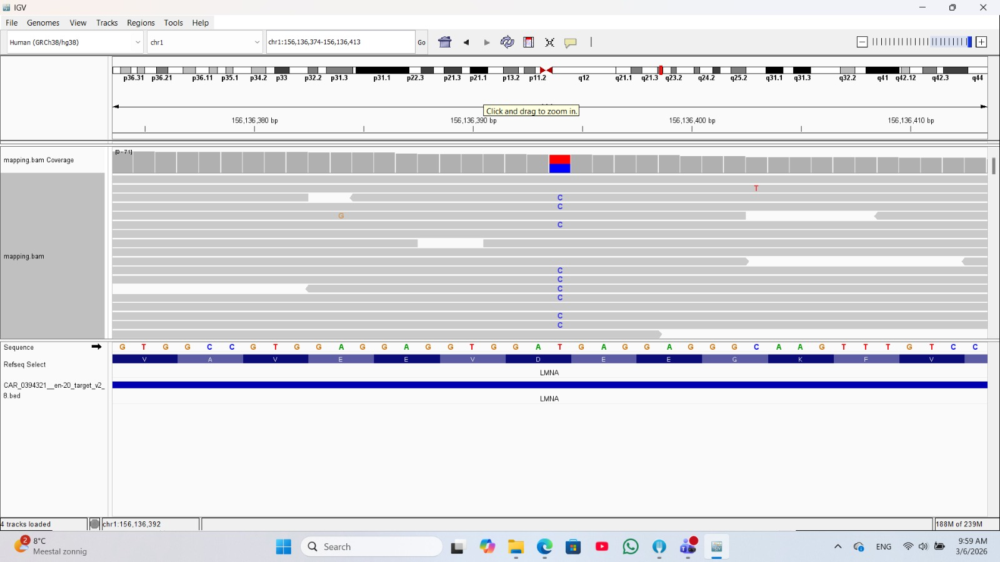

```{r setup, include=FALSE}
knitr::opts_chunk$set(
  echo = FALSE,
  warning = FALSE,
  message = FALSE,
  fig.width = 7,
  fig.height = 5,
  fig.align = "center"
)

library(knitr)
library(ggplot2)
library(dplyr)
```

# Abstract

**This section will be filled in at the end of the project and will contain a concise summary of the study, including:**

-   Background

-   Objective

-   Methods

-   Key results

-   Conclusion

# Introduction

## Background: Cardiomyopathy

Cardiomyopathy is a group of diseases that affect the heart muscle, leading to structural and functional abnormalities that impair the heart’s ability to pump blood efficiently. These conditions can result in serious clinical outcomes, including heart failure, arrhythmias, and sudden cardiac death.

Many forms of cardiomyopathy have a genetic basis. Inherited mutations have been associated with several types of the disease, such as hypertrophic, dilated, restrictive, and arrhythmogenic cardiomyopathy, as well as left ventricular non-compaction and ion channelopathies. These mutations often affect genes involved in heart muscle structure and function, including those related to the sarcomere, cytoskeleton, and ion channels.

## Aim and Research Questions

The aim of this project is to identify and evaluate genetic variants associated with cardiomyopathy using DNA sequencing data. By comparing the patient’s DNA sequence to established cardiomyopathy-associated gene panels, potentially pathogenic variants can be detected and assessed. Using next-generation sequencing (NGS) technologies, this project seeks to identify genetic variants that may contribute to the development and progression of cardiomyopathy and to evaluate their relevance in a diagnostic context.

# Materials and Methods

## Dataset Description

### Data Source

The dataset used in this project consists of DNA sequencing data obtained from patients diagnosed with cardiomyopathy. The data were provided as part of a master-level genomics course and were used for educational and research purposes.

### Number of Samples

> The dataset consists of multiple patient samples derived from cardiomyopathy cases. In this project, the analysis focuses on **Sample 1**, which is provided as paired-end sequencing data consisting of two read files (forward and reverse reads).

### File Format

> The sequencing data were provided in FASTQ format, containing the raw reads generated by next-generation sequencing and used as the input for the analysis.

## Analysis Environment

-   **Workflow platform:** Galaxy

-   **Programming language:** R

-   **Reporting framework:** R Markdown

Version control and collaboration were managed using **GitHub**, allowing transparent tracking of changes and shared development of the analysis. **Microsoft Teams** was used as the primary communication platform to coordinate the workflow, discuss results, and share progress with each other and with the course instructor.

# Analysis Workflow

The overall analysis workflow is designed to identify and characterize genetic variants from DNA sequencing data in a systematic and reproducible manner. The workflow includes quality control of raw reads, read preprocessing, alignment to a reference genome, variant calling, and variant filtering and annotation. Each step of the analysis is briefly introduced here and discussed in detail in the following subsections.

## Quality Control of Raw Reads

Quality control of raw sequencing reads was performed to evaluate data quality before downstream analysis. For this purpose, the tool **Falco** was used. A `.fastQ.gz` file was provided as input, and Falco generates several plots as output. Each plot highlights a specific aspect of the sequencing data, such as base quality scores, GC content, sequence length distribution, and the presence of adapter contamination, and provides a quality assessment in the form of **pass, warn, or fail**.

### Quality Control Results \*\* here will add the results for r1 also!

The quality control results were examined to determine whether read trimming or filtering was required before alignment. Key observations from the quality reports are summarized and interpreted in this section.

### Basic Statistics

| Measure                           | Value                                |
|-----------------------------------|--------------------------------------|
| Filename                          | Sample1_0394321_L001_R1_001_fastq_gz |
| File type                         | Conventional base calls              |
| Encoding                          | Sanger / Illumina 1.9                |
| Total Sequences                   | 1424257                              |
| Sequences Flagged As Poor Quality | 0                                    |
| Sequence length                   | 32 - 151                             |
| %GC:                              | 43                                   |

## **Per base sequence quality: pass**


## **Per tile sequence quality : pass**


## **Per sequence quality scores : pass**


## **Per base sequence content : fail**


## **Per sequence GC content: pass**


## **Per base N content : pass**


## **Sequence Length Distribution : warn**


## **Sequence Duplication Levels : warn**


## **Overrepresented sequences : pass**

No overrepresented sequences

## **Adapter Content : pass**


## Read Trimming and Filtering \*\* see the jero doc!

Based on the initial quality assessment, reads were trimmed to remove low-quality bases and sequencing adapters, ensuring that only high-quality sequences were retained for downstream analysis.

*Tool used:* (`Trimmomatic`)

### Trimming Parameters

**Tool Parameters**

| Input Parameter | Value |
|------------------------------------|------------------------------------|
| Single-end or paired-end reads? | pair_of_files |
| Input FASTQ file (R1/first of pair) |  |
| Input FASTQ file (R2/second of pair) |  |
| Perform initial ILLUMINACLIP step? | true |
| Select standard adapter sequences or provide custom? | standard |
| Adapter sequences to use | TruSeq3 (paired-ended, for MiSeq and HiSeq) |
| Maximum mismatch count which will still allow a full match to be performed | 2 |
| How accurate the match between the two 'adapter ligated' reads must be for PE palindrome read alignment | 30 |
| How accurate the match between any adapter etc. sequence must be against a read | 10 |
| Minimum length of adapter that needs to be detected (PE specific/palindrome mode) | 8 |
| Always keep both reads (PE specific/palindrome mode)? | true |
| Select Trimmomatic operation to perform | SLIDINGWINDOW |
| Number of bases to average across | 4 |
| Average quality required | 20 |
| Select Trimmomatic operation to perform | CROP |
| Number of bases to keep from the start of the read | 145 |
| Select Trimmomatic operation to perform | HEADCROP |
| Number of bases to remove from the start of the read | 7 |
| Select Trimmomatic operation to perform | MINLEN |
| Minimum length of reads to be kept | 50 |
| Quality score encoding | Nothing selected. |
| Output trimlog file? | false |
| Output trimmomatic log messages? | false |

### Quality Control Results After Trimming

#### - Sample1_R1_fastq_gz_R1 paired

## **Basic Statistics: pass**

| Measure | Value |
|:----------------------------------:|:----------------------------------:|
| Filename | Trimmomatic on Sample1_0394321_L001_R1_001_fastq_gz \_R1 paired\_ |
| File type | Conventional base calls |
| Encoding | Sanger / Illumina 1.9 |
| Total Sequences | 1206159 |
| Sequences Flagged As Poor Quality | 0 |
| Sequence length | 50 - 138 |
| %GC: | 42 |

## **Per base sequence quality: pass**


## **Per tile sequence quality: pass**


## **Per sequence quality scores: pass**


## **Per base sequence content : pass**


## **Per sequence GC content: pass**


## **Per base N content : pass**


## **Sequence Length Distribution : warn**


## **Sequence Duplication Levels : warn**


## **Overrepresented sequences : pass**

### No overrepresented sequences

## **Adapter Content : pass**


#### - Sample1_R2_fastq_gz_R2 paired

## **Basic Statistics: pass**

| Measure | Value |
|:----------------------------------:|:----------------------------------:|
| Filename | Trimmomatic on Sample1_0394321_L001_R2_001_fastq_gz \_R2 paired\_ |
| File type | Conventional base calls |
| Encoding | Sanger / Illumina 1.9 |
| Total Sequences | 1206159 |
| Sequences Flagged As Poor Quality | 0 |
| Sequence length | 50 - 138 |
| %GC: | 42 |

## **Per base sequence quality: pass**


## **Per tile sequence quality: pass**


## **Per sequence quality scores: pass**


## **Per base sequence content : warn**


## **Per sequence GC content: pass**


## **Per base N content : pass**


## **Sequence Length Distribution : warn**


## **Sequence Duplication Levels : warn**


## **Overrepresented sequences : pass**

### No overrepresented sequences

## **Adapter Content : pass**


## Read Alignment (mapping with jero)

Filtered reads were aligned to the appropriate human reference genome using a short-read aligner.

**Reference genome:**

**Alignment tool: BWA**

### Alignment Statistics

Key alignment metrics such as mapping rate and coverage were evaluated.

coverage with jero !

### Marking Duplicate Mapped Reads

Before analyzing differences between the reference genome and our patient sample, duplicate mapped reads must be identified. Duplicates arise from PCR amplification bias (multiple copies of the same fragment) or optical artifacts during sequencing, and if unaddressed, can lead to false positive variant calls and inaccurate coverage estimates.

We used `MarkDuplicates` tool on the coordinate-sorted BAM files from the previous mapping step. The algorithm identifies duplicate pairs by comparing read coordinates, orientations, and insert sizes, then adds a duplicate flag to each identified duplicate read. Importantly, reads are flagged but not removed, preserving data integrity while allowing downstream tools to ignore these flagged reads during analysis.

**The output includes:**

A marked BAM file `.marked.bam`: alignment data with duplicate flags

A BAM index file `.bai`: enables rapid random access for visualization

These files serve as input for the next step: visualizing the mapping data without the confounding effects of duplicates.

### Visualizing the Mapping Data

#### Integrative Genomics Viewer (IGV)

To visually inspect the mapped reads and identify potential variants, we used the **Integrative Genomics Viewer (IGV)**. This tool enabled visualization of read alignment, coverage depth, and nucleotide changes across target regions, using the BED file to navigate directly to genes of interest.

#### Reference Genome and Data Files

The reference genome used for visualization was **GRCh38/hg38** (Genome Reference Consortium Human Build 38), which provides a high-quality assembly of the human genome. 

For this visualization step, we used two primary input files:

1.  **Marked BAM file** (`dataset.bam`): Contains the aligned reads with duplicate flags, enabling accurate visualization without PCR bias.

2.  **Target BED file** (`CAR_0394321_en-20_target_v2_8.bed`): A interval file specifying all captured regions in the gene panel.

The BED file contains four columns specifying the chromosome, exon start and end positions, and gene name (e.g., PSEN2, LMNA), allowing us to navigate directly to regions of interest. This BED file served as a navigation guide, allowing us to rapidly zoom into specific genes of interest and examine their coverage and potential variants.

#### Variant Identification

Using the BED file to navigate, we examined two different genes of interest. Below are representative examples of variants identified in this analysis:

**Figure 1: PSEN2 Gene Region**


A variant was identified in the PSEN2 gene at the stop codon position. The reference sequence shows a stop codon (TGA), while the patient sample displays a T nucleotide (red) at this position, changing the codon to CGA, which encodes Arginine (ARG). This stop-loss variant would result in an extended protein product, potentially altering its normal function.

**Figure 2: LMNA Gene Region**



Visualization of the LMNA gene showing a heterozygous variant. The aligned reads display both reference and alternative alleles (mixed colors at the variant position), with approximately equal representation. Heterozygous variants in LMNA are known to be associated with dilated cardiomyopathy (DCM).

## Mapping Quality Control

In this section, we assessed the mapping coverage for all panel genes to evaluate mapping performance. As observed in IGV, coverage levels varied significantly across regions, ranging from very high (300+) to areas with only a few reads present, which can impact variant detection reliability. Using **R** with libraries commonly used in genetic research, we calculated and reported coverage statistics for all panel genes to quantitatively assess these variations and identify undercovered regions.

**Loading the BED-data**

The first step is to load the BED file containing the exon coordinates of our panel genes. The file is tab-separated and has four columns: chromosome, start, end, and gene name. We will read it into R, assign proper column names, and then examine the distribution of exons across chromosomes.

```{r}

bed_file <- "./BedFile.bed"

exons <- read.table(bed_file, header = FALSE, sep = "\t", stringsAsFactors = FALSE)

colnames(exons) <- c("chromosome", "start", "end", "gene")

head(exons)
View(exons)

# Count exons per chromosome
exon_counts <- table(exons$chromosome)
print(exon_counts)

# Plot the number of exons per chromosome
barplot(exon_counts, 
        main = "Number of exons per chromosome",
        ylab = "Exon count",
        xlab = "Chromosome",
        las = 2,
)       

```
**BED-visualization**

In this section, we visualized the distribution of genes across different chromosomes using the BED data. First, we reduced the data to unique chromosome-gene combinations, then counted the number of genes per chromosome and presented the results in a bar plot. This visualization provides a clear overview of how genes are distributed across chromosomes, helping to identify which chromosomes carry the most genes in our panel.

```{r}
chromosome_gene <- subset(exons, select = c(chromosome, gene))
head(chromosome_gene)

uni_gene <- unique(chromosome_gene)

head(uni_gene)
#View(uni_gene)

gene_counts <- table(uni_gene$chromosome)

barplot(gene_counts, 
        main = "Number of gene per chromosome",
        ylab = "Number of genes",
        xlab = "Chromosome",
        las = 2,
    )
```
**Bioconductor**

```{r}
# This package contains the 'IRanges', 'GRanges' and 'GRangesList' classes we will use
library(GenomicRanges)
# Print all rows where the gene name is for example 'SOD2'
sod2 <- exons[exons$gene == "SOD2", ]

# Assign whole columns to the IRanges arguments
#ranges <- IRanges(start = sod2$begin,
 #                 end = sod2$end,
  #                names = sod2$gene)
# Print the object
#ranges
```

## Variant Calling

Variant calling was performed to identify single nucleotide variants (SNVs) and small insertions/deletions (indels) from the aligned reads.

*Variant caller used:*

### Raw Variant Output

The initial variant call set contains all detected variants prior to filtering.

## Variant Filtering

Variants were filtered based on quality metrics to reduce false positives. Filtering criteria included read depth, variant quality score, and allele frequency.

### Filtering Criteria

-   Minimum depth (DP):

-   Minimum quality (QUAL):

```         
# Summary of filtered variants 
```

## Variant Annotation

Filtered variants were annotated to identify affected genes and potential functional consequences.

*Annotation tool/database:*

# Results

## Variant Summary

A total of (X) variants were retained after filtering. These variants include SNPs and small indels distributed across multiple genomic regions.

```         
# Tables or plots summarizing variants 
```

## Candidate Variants Related to Cardiomyopathy

Several variants were identified in genes previously associated with cardiomyopathy. These variants represent potential contributors to disease development.

# Discussion

The identified variants provide insight into the genetic basis of cardiomyopathy in the analyzed patient sample. While some variants occur in known cardiomyopathy-associated genes, further validation is required to assess their pathogenicity.

### Limitations

-   Analysis based on a single sample

-   Lack of functional validation

-   Potential sequencing and alignment biases

# Conclusion

This project demonstrates a reproducible workflow for variant discovery in cardiomyopathy using NGS data. The documented pipeline can be extended to additional samples and integrated with functional and clinical data for improved interpretation.

# References

(To be added)
