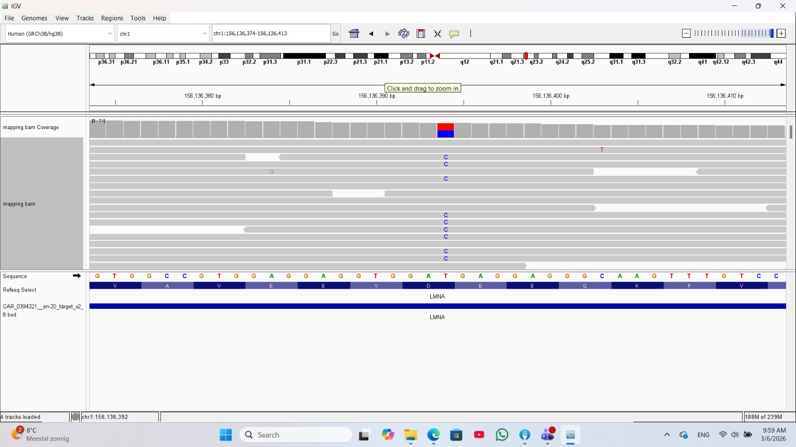

```{r setup, include=FALSE}
knitr::opts_chunk$set(
  echo = FALSE,
  warning = FALSE,
  message = FALSE,
  fig.width = 7,
  fig.height = 5,
  fig.align = "center"
)

library(knitr)
library(ggplot2)
library(dplyr)
```

# Abstract

**This section will be filled in at the end of the project and will contain a concise summary of the study, including:**

-   Background

-   Objective

-   Methods

-   Key results

-   Conclusion

# Introduction

## Background: Cardiomyopathy

Cardiomyopathy is a group of diseases that affect the heart muscle, leading to structural and functional abnormalities that impair the heart’s ability to pump blood efficiently. These conditions can result in serious clinical outcomes, including heart failure, arrhythmias, and sudden cardiac death.

Many forms of cardiomyopathy have a genetic basis. Inherited mutations have been associated with several types of the disease, such as hypertrophic, dilated, restrictive, and arrhythmogenic cardiomyopathy, as well as left ventricular non-compaction and ion channelopathies. These mutations often affect genes involved in heart muscle structure and function, including those related to the sarcomere, cytoskeleton, and ion channels.

## Aim and Research Questions

The aim of this project is to identify and evaluate genetic variants associated with cardiomyopathy using DNA sequencing data. By comparing the patient’s DNA sequence to established cardiomyopathy-associated gene panels, potentially pathogenic variants can be detected and assessed. Using next-generation sequencing (NGS) technologies, this project seeks to identify genetic variants that may contribute to the development and progression of cardiomyopathy and to evaluate their relevance in a diagnostic context.

# Materials and Methods

## Dataset Description

### Data Source

The dataset used in this project consists of DNA sequencing data obtained from patients diagnosed with cardiomyopathy. The data were provided as part of a master-level genomics course and were used for educational and research purposes.

### Number of Samples

> The dataset consists of multiple patient samples derived from cardiomyopathy cases. In this project, the analysis focuses on **Sample 1**, which is provided as paired-end sequencing data consisting of two read files (forward and reverse reads).

### File Format

> The sequencing data were provided in FASTQ format, containing the raw reads generated by next-generation sequencing and used as the input for the analysis. This is the first line in the file:
>
> ```         
> @M01234:01:000000000-A1B2C:1:1101:16810:1655 2:N:0:2
> AATGACATTGATCTCCACAGCCATCAAGAGCCCATTCAAGATGACCATCATGCCTGTGATGCAGAAACGCAGGTTTGATATGTCCAAGCCAGACTGACAGTACTTAACCAATTTTATTGTTTTTGTAATAAAGGCCCTTACCCAATACAGG
> +
> 11A11DDFDDB@GGGGCF11FA1GGF1GBCCBFHHHHGHFCGHFFHFHB1F1FFHBF1BG2DFBGF1FC/EE/A1D/1A2DBGGHFFFE/000FG11BF1GFGFHHFHHEHHHGHHGBDFHFHG/BE2F2>FH1>E/FE11BG</B1<110
> ```

## Analysis Environment

-   **Workflow platform:** Galaxy

-   **Programming language:** R

-   **Reporting framework:** R Markdown

Version control and collaboration were managed using **GitHub**, allowing transparent tracking of changes and shared development of the analysis. **Microsoft Teams** was used as the primary communication platform to coordinate the workflow, discuss results, and share progress with each other and with the course instructor.

# Analysis Workflow

The overall analysis workflow is designed to identify and characterize genetic variants from DNA sequencing data in a systematic and reproducible manner. The workflow includes quality control of raw reads, read preprocessing, alignment to a reference genome, variant calling, and variant filtering and annotation. Each step of the analysis is briefly introduced here and discussed in detail in the following subsections.

## Quality Control of Raw Reads

Quality control of raw sequencing reads was performed to evaluate data quality before downstream analysis. For this purpose, the tool **Falco** was used. A `.fastQ.gz` file was provided as input, and Falco generates several plots as output. Each plot highlights a specific aspect of the sequencing data, such as base quality scores, GC content, sequence length distribution, and the presence of adapter contamination, and provides a quality assessment in the form of **pass, warn, or fail**.

### Quality Control Results \*\* Here will add the results for r1 also! \*\*

The quality control results were examined to determine whether read trimming or filtering was required before alignment. Key observations from the quality reports are summarized and interpreted in this section.

### Basic Statistics

| Measure                           | Value                                |
|-----------------------------------|--------------------------------------|
| Filename                          | Sample1_0394321_L001_R1_001_fastq_gz |
| File type                         | Conventional base calls              |
| Encoding                          | Sanger / Illumina 1.9                |
| Total Sequences                   | 1424257                              |
| Sequences Flagged As Poor Quality | 0                                    |
| Sequence length                   | 32 - 151                             |
| %GC:                              | 43                                   |

## **Per base sequence quality: pass**

Per-base sequence quality refers to the assessment of quality scores for each nucleotide position in sequencing reads. This was evaluated using Falco, which generates a box-and-whisker plot showing Phred scores across all read positions. According to FastQC standards, a warning is issued if the lower quartile falls below 10 or the median falls below 25, whereas a failure is reported if the lower quartile falls below 5 or the median falls below **20**. The results show that all base positions in our data have quality scores ranging from **33.0 to 44.0**, which is well above both warning and failure thresholds. This indicates that our sequencing data pass the quality control check with high confidence in base-calling accuracy across all positions.


## **Per tile sequence quality : pass**

Per tile sequence quality examines quality variation between different tiles on the flow cell using a color scale where blue indicates average or above-average quality and red indicates lower quality. A warning is issued if any tile falls more than **2** Phred scores below the mean, and failure if more than **5** below. Our results show consistent blue coloration across all tiles with no significant deviations, confirming that the data **passes** this quality control check.


## **Per sequence quality scores : pass**

Per sequence quality scores examine whether subsets of sequences have universally low quality values, which may indicate systematic issues like poor imaging at flow cell edges. A warning is issued if the most frequently observed mean quality falls below **27 (0.2% error rate)**, and failure occurs below **20 (1% error rate)**. In our results, the majority of sequences have mean quality scores above 30, well above both thresholds, confirming that the data passes this quality check.


## **Per base sequence content : fail**

Per base sequence content analyzes the proportion of each nucleotide (A, T, C, G) at every position across all reads. In a properly balanced library, the lines for each base should run parallel with only small differences between A and T or G and C. A warning is issued if the difference between A and T or G and C exceeds **10%** at any position, and failure occurs if the difference exceeds **20%**.


In our results, the data failed this module. As shown, there is a consistent imbalance between A and T across most positions, with A averaging around **29%** while T averages only **21%**, creating a difference of approximately **8%**. While this difference is below the failure threshold, it still exceeds the warning threshold, indicating a systematic bias in nucleotide distribution that may need to be addressed before further analysis.

## **Per sequence GC content: pass**

Per sequence GC content measures the distribution of G and C bases across all reads, plotted as the number of reads versus GC percentage. A normal distribution is expected for high-quality data, with the peak matching the genome's overall GC content.


Our results passed this module, showing a GC distribution that closely follows the theoretical distribution. As shown, the highest density of reads occurs at **50-60%** GC, which aligns well with the expected pattern for this dataset. This indicates no significant GC bias in the sequencing data.

## **Per base N content : pass**

Per base N content measures the proportion of ambiguous base calls (N) at each position across all reads. Low N content, especially near read ends, is normal and expected. A warning is issued if any position exceeds **5%** N content, and failure occurs if above **20%**. Our results passed this module, with N content remaining consistently low **(below 0.04%)** across all positions. This indicates high-quality base calling with minimal ambiguity throughout the sequencing run.


## **Sequence Length Distribution : warn**

Sequence length distribution analyzes the range of fragment sizes in the raw sequencing data. A warning is issued if all sequences are not the same length, while failure occurs if any sequence has zero length. Our results show a warning in this module, indicating that the reads in our raw dataset are not all identical in length.


## **Sequence Duplication Levels : warn**

Sequence duplication levels measure the proportion of duplicate reads in the sequencing data. This module identifies reads that appear more than once, which can indicate over-amplification during library preparation. A warning is issued when non-unique reads make up more than **20%** of the total sequences. Our results show a warning in this module, indicating a moderate level of duplication in the dataset.


## **Overrepresented sequences : pass**

Overrepresented sequences are those that appear more frequently than expected in the dataset. Our results passed this module as no overrepresented sequences were found.

## **Adapter Content : pass**

Adapter content assesses the presence of adapter sequences in the reads, which can occur when fragments are shorter than the read length. A warning is issued if any adapter is present in more than **5%** of reads, and failure occurs if above **10%**. Our results passed this module with very low adapter content **(below 0.8%)** across all positions, indicating minimal adapter contamination.


## Read Trimming and Filtering (**we can use the jero table)**

Based on the initial quality assessment, reads were trimmed to remove low-quality bases and sequencing adapters, ensuring that only high-quality sequences were retained for downstream analysis.

**Tool used:** (`Trimmomatic`)

### Trimming Parameters

Based on our quality control results, we selected specific parameters for trimming with Trimmomatic. We kept the default values for the adapter clipping settings, and added several parameters to address issues identified in the quality report: we applied CROP to 145 bases to remove positions beyond 145 that showed noise in the per base sequence content, used HEADCROP of 7 bases to eliminate low-quality bases from the read starts, and set MINLEN to 50 to discard short reads after trimming, ensuring high-quality data for subsequent analysis.

**Tool Parameters**

| Input Parameter | Value |
|----|----|
| Single-end or paired-end reads? | pair_of_files |
| Input FASTQ file (R1/first of pair) |  |
| Input FASTQ file (R2/second of pair) |  |
| Perform initial ILLUMINACLIP step? | true |
| Select standard adapter sequences or provide custom? | standard |
| Adapter sequences to use | TruSeq3 (paired-ended, for MiSeq and HiSeq) |
| Maximum mismatch count which will still allow a full match to be performed | 2 |
| How accurate the match between the two 'adapter ligated' reads must be for PE palindrome read alignment | 30 |
| How accurate the match between any adapter etc. sequence must be against a read | 10 |
| Minimum length of adapter that needs to be detected (PE specific/palindrome mode) | 8 |
| Always keep both reads (PE specific/palindrome mode)? | true |
| Select Trimmomatic operation to perform | SLIDINGWINDOW |
| Number of bases to average across | 4 |
| Average quality required | 20 |
| Select Trimmomatic operation to perform | CROP |
| Number of bases to keep from the start of the read | 145 |
| Select Trimmomatic operation to perform | HEADCROP |
| Number of bases to remove from the start of the read | 7 |
| Select Trimmomatic operation to perform | MINLEN |
| Minimum length of reads to be kept | 50 |
| Quality score encoding | Nothing selected. |
| Output trimlog file? | false |
| Output trimmomatic log messages? | false |

### Quality Control Results After Trimming

#### - Sample1_R1_fastq_gz_R1 paired

## **Basic Statistics: pass**

| Measure | Value |
|:--:|:--:|
| Filename | Trimmomatic on Sample1_0394321_L001_R1_001_fastq_gz \_R1 paired\_ |
| File type | Conventional base calls |
| Encoding | Sanger / Illumina 1.9 |
| Total Sequences | 1206159 |
| Sequences Flagged As Poor Quality | 0 |
| Sequence length | 50 - 138 |
| %GC: | 42 |

## **Per base sequence quality: pass**


## **Per tile sequence quality: pass**


## **Per sequence quality scores: pass**


## **Per base sequence content : pass**


## **Per sequence GC content: pass**


## **Per base N content : pass**


## **Sequence Length Distribution : warn**


## **Sequence Duplication Levels : warn**


## **Overrepresented sequences : pass**

### No overrepresented sequences

## **Adapter Content : pass**


#### - Sample1_R2_fastq_gz_R2 paired

## **Basic Statistics: pass**

| Measure | Value |
|:--:|:--:|
| Filename | Trimmomatic on Sample1_0394321_L001_R2_001_fastq_gz \_R2 paired\_ |
| File type | Conventional base calls |
| Encoding | Sanger / Illumina 1.9 |
| Total Sequences | 1206159 |
| Sequences Flagged As Poor Quality | 0 |
| Sequence length | 50 - 138 |
| %GC: | 42 |

## **Per base sequence quality: pass**


## **Per tile sequence quality: pass**


## **Per sequence quality scores: pass**


## **Per base sequence content : warn**


## **Per sequence GC content: pass**


## **Per base N content : pass**


## **Sequence Length Distribution : warn**


## **Sequence Duplication Levels : warn**


## **Overrepresented sequences : pass**

### No overrepresented sequences

## **Adapter Content : pass**


## Read Alignment (mapping with jero)

Filtered reads were aligned to the appropriate human reference genome using a short-read aligner.

**Reference genome:**

**Alignment tool: BWA**

### Alignment Statistics

Key alignment metrics such as mapping rate and coverage were evaluated.

coverage with jero !

### Marking Duplicate Mapped Reads

Before analyzing differences between the reference genome and our patient sample, duplicate mapped reads must be identified. Duplicates arise from PCR amplification bias (multiple copies of the same fragment) or optical artifacts during sequencing, and if unaddressed, can lead to false positive variant calls and inaccurate coverage estimates.

We used `MarkDuplicates` tool on the coordinate-sorted BAM files from the previous mapping step. The algorithm identifies duplicate pairs by comparing read coordinates, orientations, and insert sizes, then adds a duplicate flag to each identified duplicate read. Importantly, reads are flagged but not removed, preserving data integrity while allowing downstream tools to ignore these flagged reads during analysis.

**The output includes:**

A marked BAM file `.marked.bam`: alignment data with duplicate flags

A BAM index file `.bai`: enables rapid random access for visualization

These files serve as input for the next step: visualizing the mapping data without the confounding effects of duplicates.

### Visualizing the Mapping Data

#### Integrative Genomics Viewer (IGV)

To visually inspect the mapped reads and identify potential variants, we used the **Integrative Genomics Viewer (IGV)**. This tool enabled visualization of read alignment, coverage depth, and nucleotide changes across target regions, using the BED file to navigate directly to genes of interest.

#### Reference Genome and Data Files

The reference genome used for visualization was **GRCh38/hg38** (Genome Reference Consortium Human Build 38), which provides a high-quality assembly of the human genome. 

For this visualization step, we used two primary input files:

1.  **Marked BAM file** (`dataset.bam`): Contains the aligned reads with duplicate flags, enabling accurate visualization without PCR bias.

2.  **Target BED file** (`CAR_0394321_en-20_target_v2_8.bed`): A interval file specifying all captured regions in the gene panel.

The BED file contains four columns specifying the chromosome, exon start and end positions, and gene name (e.g., PSEN2, LMNA), allowing us to navigate directly to regions of interest. This BED file served as a navigation guide, allowing us to rapidly zoom into specific genes of interest and examine their coverage and potential variants.

#### Variant Identification

Using the BED file to navigate, we examined two different genes of interest. Below are representative examples of variants identified in this analysis:

**Figure 1: PSEN2 Gene Region**


A variant was identified in the PSEN2 gene at the stop codon position. The reference sequence shows a stop codon (TGA), while the patient sample displays a T nucleotide (red) at this position, changing the codon to CGA, which encodes Arginine (ARG). This stop-loss variant would result in an extended protein product, potentially altering its normal function.

**Figure 2: LMNA Gene Region**



Visualization of the LMNA gene showing a heterozygous variant. The aligned reads display both reference and alternative alleles (mixed colors at the variant position), with approximately equal representation. Heterozygous variants in LMNA are known to be associated with dilated cardiomyopathy (DCM).

## Mapping Quality Control

In this section, we assessed the mapping coverage for all panel genes to evaluate mapping performance. As observed in IGV, coverage levels varied significantly across regions, ranging from very high (300+) to areas with only a few reads present, which can impact variant detection reliability. Using **R** with libraries commonly used in genetic research, we calculated and reported coverage statistics for all panel genes to quantitatively assess these variations and identify undercovered regions.

**Loading the BED-data**

The first step is to load the BED file containing the exon coordinates of our panel genes. The file is tab-separated and has four columns: chromosome, start, end, and gene name. We will read it into R, assign proper column names, and then examine the distribution of exons across chromosomes.

```{r}

bed_file <- "./BedFile.bed"

exons <- read.table(bed_file, header = FALSE, sep = "\t", stringsAsFactors = FALSE)

colnames(exons) <- c("chromosome", "start", "end", "gene")

head(exons)
#View(exons)

# Count exons per chromosome
exon_counts <- table(exons$chromosome)
print(exon_counts)

# Plot the number of exons per chromosome
barplot(exon_counts, 
        main = "Number of exons per chromosome",
        ylab = "Exon count",
        xlab = "Chromosome",
        las = 2,
)       

```

This barplot shows the number of exons located on each chromosome in our dataset. Chromosomes with higher exon counts typically contain more genes or longer genes with multiple exons. For example, chromosome 2 has the highest exon count (around 250-300). In contrast, chromosomes like chr18, chr20, and chrX have fewer exons, indicating they may contain fewer genes or genes with simpler structures.

```{r}
#exon_counts_df <- as.data.frame(exon_counts)
#colnames(exon_counts_df) <- c("chromosome", "exon_count")
```

**BED-visualization**

In this section, we visualized the distribution of genes across different chromosomes using the BED data. First, we reduced the data to unique chromosome-gene combinations, then counted the number of genes per chromosome and presented the results in a bar plot. This visualization provides a clear overview of how genes are distributed across chromosomes, helping to identify which chromosomes carry the most genes in our panel.

```{r}
chromosome_gene <- subset(exons, select = c(chromosome, gene))
head(chromosome_gene)

uni_gene <- unique(chromosome_gene)

head(uni_gene)
#View(uni_gene)

gene_counts <- table(uni_gene$chromosome)

barplot(gene_counts, 
        main = "Number of gene per chromosome",
        ylab = "Number of genes",
        xlab = "Chromosome",
        las = 2,
    )
```

This plot shows the number of genes per chromosome, and it directly explains the previous exon distribution. Chromosome 2 has the highest gene count (7 genes), which is why it also had the highest exon count (250-300). Chromosomes with fewer genes consistently showed fewer exons, confirming that exon numbers reflect gene density across chromosomes.

**Bioconductor**

Bioconductor is a repository containing over 1800 R packages specifically designed for analyzing high-throughput biological data, which we used throughout this assignment.

**Why Convert IRanges to GRanges?**

The IRanges object contains exon positions and lengths but lacks chromosome information, making it incomplete for genomic analysis. Converting to a GRanges object adds the chromosome context, creating a complete genomic coordinate system that properly locates each exon in the genome.

**Assignment 3**

The BED file was first represented as an IRanges object since it contains simple positional data such as chromosome names and start/stop positions. These IRanges objects were then converted to GenomicRanges objects, which store genomic features (like exons) along with their chromosome coordinates and strand information.

```{r}
# Split the data by gene, resulting in a list with named elements
bed_splitted <- split(exons, exons$gene)
#View(bed_splitted)
my_list <- list()

for (gene in names(bed_splitted)[1:55]) {
  
  data <- bed_splitted[[gene]]

  ranges <- IRanges(start = data$start,
                  end = data$end)
  #print(ranges)
 granges <- GRanges(seqnames = data$chromosome,
                   ranges = ranges) 
 
 my_list[[gene]] <- granges

}

final_GRange_list <- GRangesList(my_list) 

#class(final_GRange_list)
#elementType(final_GRange_list)

#print(final_GRange_list)

```

**Gene Lengths Visualization**

After creating the GRanges objects, we calculated the length of each gene using the width and sum functions on the GRangesList. Since some genes are much longer than others, a standard barplot would be difficult to read. We used the `gap.barplot` function from the plotrix library, which allows us to create a barplot with a gap in the y-axis to accommodate extremely long genes while still showing variation among shorter genes.

```{r}
library(plotrix)

gene_lengths_list <- list()

for (gene in names(final_GRange_list)) {
  gene_ranges <- ranges(final_GRange_list[[gene]])
  length_value <- sum(width(gene_ranges))
  gene_lengths_list[[gene]] <- length_value
}

# Sort genes by length
gene_lengths <- sort(gene_lengths, decreasing = TRUE)

# Create barplot with gap
gap.barplot(gene_lengths,
            gap = c(5000, 80000),  # Creates gap between 5000 and 80000
            xlab = "Genes",
            ylab = "Gene Length (bp)",
            main = "Gene Lengths Distribution",
            las = 2, 
            ytics = seq(0, 100000, by = 5000))  # Add more tick marks

```

```{r}
# Simple barplot with more tick marks
barplot(gene_lengths,
        xlab = "Genes",
        ylab = "Gene Length (bp)",
        main = "Gene Lengths Distribution",
        las = 2,
        ylim = c(0, 100000),
        yaxt = "n")  # Remove default y-axis

# Add custom y-axis
axis(2, at = seq(0, 100000, by = 5000), las = 2)
```

**Loading the Mapped Reads**

We used the output from the mapping step (the BAM file) to inspect the coverage of all mapped positions across our panel genes. The Rsamtools library provides the necessary functions to read and process this alignment data into GRanges objects for further analysis.

First, we used the *BamFile* function to create a reference to our BAM file and its index, which allowed us to access the alignment data efficiently without loading the entire file into memory. Then, to extract only our specific gene regions from the BED-data, we used the *ScanBamParam* function with GRanges objects to set the parameters for selection. Finally, we applied the *pileup* function to retrieve the coverage information for these regions, which returned the actual read counts at each position within our genes for downstream analysis.

```{r}
# Loading the RSamtools library
library(Rsamtools)

bam_file <- BamFile(file="./mapping.bam", index = "./mapping.bam.bai")

TTN_gene <- final_GRange_list[["TTN"]]

ScanParam_gene <-ScanBamParam(which = TTN_gene)

pileup_data <- pileup(file = bam_file, scanBamParam = ScanParam_gene)

head(pileup_data)


```

**Pileup Processing**

Here, we will obtain the pileup data for all our genes and store it in a single object `pileup_list`. This will allow us to calculate the average coverage for each gene and identify positions with low coverage that may require further inspection.

```{r}
pileup_list <- list()

for (gene in names(final_GRange_list)) {
  
  data <- final_GRange_list[[gene]]

 ScanParam_gene <-ScanBamParam(which = data)

pileup_data <- pileup(file = bam_file, scanBamParam = ScanParam_gene)
 
 pileup_list[[gene]] <- pileup_data

}
head(pileup_list[["TTN"]])
```

**Coverage calculation and reporting**

In this assignment, we calculated the per-position coverage for each gene using the *aggregate* function, which sums the count values for each unique position across all reads. For every gene, we then determined: the number of bases sequenced, the average coverage, the number of low-coverage positions (below 30), and the percentage of low-coverage positions. These four values were stored in a new data frame along with the gene name, and the final results were ordered by the percentage of low-coverage positions in descending order for easy interpretation.

```{r}
options(stringsAsFactors = FALSE)

per_position_coverage <- data.frame(Gene = character(),
                           NumBases = integer(),
                           AvgCoverage = numeric(),
                           LowCovPos = integer(),
                           LowCovPerc = numeric())

for (gene_name in names(pileup_list)) {
  
  gene_data <- pileup_list[[gene_name]]
  
  coverage <- aggregate(x = list(count = gene_data$count),
                       by = list(pos = gene_data$pos),
                       FUN = sum)
  
  num_bases <- nrow(coverage)
  avg_cov <- mean(coverage$count)
  low_cov_num <- sum(coverage$count < 30)
  low_cov_perc <- (low_cov_num / num_bases) * 100
  
  new_row <- list(Gene = gene_name,
                  NumBases = num_bases,
                  AvgCoverage = avg_cov,
                  LowCovPos = low_cov_num,
                  LowCovPerc = low_cov_perc)
  
  per_position_coverage <- rbind(per_position_coverage, new_row)
  
}

print("All genes processed:")
print(per_position_coverage)

```

## Variant Calling

Variant calling was performed to identify single nucleotide variants (SNVs) and small insertions/deletions (indels) from the aligned reads.

*Variant caller used:*

### Raw Variant Output

The initial variant call set contains all detected variants prior to filtering.

## Variant Filtering

Variants were filtered based on quality metrics to reduce false positives. Filtering criteria included read depth, variant quality score, and allele frequency.

### Filtering Criteria

-   Minimum depth (DP):

-   Minimum quality (QUAL):

```         
# Summary of filtered variants 
```

## Variant Annotation

Filtered variants were annotated to identify affected genes and potential functional consequences.

*Annotation tool/database:*

# Results

## Variant Summary

A total of (X) variants were retained after filtering. These variants include SNPs and small indels distributed across multiple genomic regions.

```         
# Tables or plots summarizing variants 
```

## Candidate Variants Related to Cardiomyopathy

Several variants were identified in genes previously associated with cardiomyopathy. These variants represent potential contributors to disease development.

# Discussion

The identified variants provide insight into the genetic basis of cardiomyopathy in the analyzed patient sample. While some variants occur in known cardiomyopathy-associated genes, further validation is required to assess their pathogenicity.

### Limitations

-   Analysis based on a single sample

-   Lack of functional validation

-   Potential sequencing and alignment biases

# Conclusion

This project demonstrates a reproducible workflow for variant discovery in cardiomyopathy using NGS data. The documented pipeline can be extended to additional samples and integrated with functional and clinical data for improved interpretation.

# References

(To be added)
